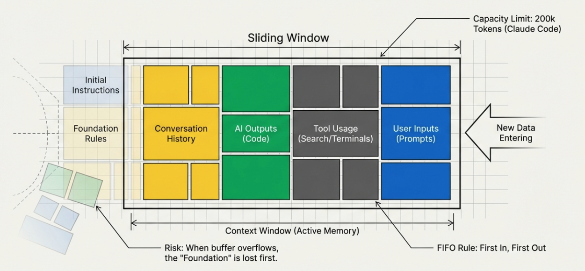

# コンテキストエンジニアリングを学ぼう

## はじめに

本資料は、Claude CodeやCursor、CodexといったAIコーディングエージェントの潜在能力を最大限に引き出すための概念「コンテキストエンジニアリング」についての包括的なガイドです。AIの「記憶領域」であるコンテキストウィンドウの仕組みを理解し、適切に管理することで、コーディングの精度を10倍から20倍に向上させることができます。

主要な戦略として、LangChainの提唱する「記述（Write）」「選択（Select）」「圧縮（Compress）」「分離（Isolate）」の4原則を軸に、仕様書駆動開発（スペック駆動開発）の実践方法や、サブエージェントおよびMCP（Model Context Protocol）を活用した高度なコンテキスト管理手法を詳しく解説します。

## コンテキストウィンドウの基礎概念

AIコーディングエージェント（LLM）には「コンテキストウィンドウ」と呼ばれる記憶領域が設定されており、これがAIのパフォーマンスを左右する決定的な要因となります。

**記憶の限界**
人間の短期記憶と同様に、LLMが一度に保持できる情報量には上限があります（例：Claude Codeでは通常20万トークン）。

**コンテキスト溢れの問題**
指示や対話が重なり、ウィンドウの限界を超えると、過去の履歴から順に「記憶」が抜け落ちます。これにより、AIが以前の指示を無視したり、禁止された実装を繰り返したりする現象が発生します。

**構成要素**
コンテキストウィンドウには以下のデータが含まれます。

* ユーザーからのインプット（プロンプト）
* AIによるツール実行（ファイル検索、コード編集等）の履歴
* 最終的なアウトプット（メッセージ）

## コンテキストエンジニアリングの4原則

効率的な開発環境を構築するために、以下の4つのアプローチを組み合わせてコンテキストを最適化します。

### 記述 (Write)

AIの「忘れっぽさ」を補うため、外部メモリとしてドキュメントを残す原則です。

**外部記憶の活用**
docs/ ディレクトリを作成し、要件定義書、仕様書、タスク管理用のチケットファイル、守ってほしいルールなどをマークダウン形式で管理します。

**メリット**
コンテキストウィンドウから過去の会話が消えても、AIはこれらのファイルを参照することで常に最新の要件を把握できます。

### 選択 (Select)

必要なタイミングで、適切なファイルのみをAIに読み込ませる技術です。

**参照の最適化**
出力精度が低下した際や、特定のフェーズに移行する際に、関連するドキュメントを明示的に参照させます。

### 圧縮 (Compress)

限られたコンテキスト容量を節約するため、情報を要約する原則です。

**オートコンパクト機能**
Claude Codeなどのツールには、コンテキストが少なくなった際に自動で会話履歴を圧縮する機能が備わっています。

**手動圧縮**
特定のコマンド（例：/compact）を使用して、会話履歴をクリアしつつ、その内容の要約のみを保持することで容量を確保します。

### 分離 (Isolate)

メインのコンテキストを汚染しないよう、タスクごとにエージェントやコンテキストを分ける原則です。

**サブエージェントの活用**
特定のタスク（デザイン調査、パフォーマンス改善、セキュリティ監査等）専用のサブエージェントを立ち上げ、独立したコンテキストで作業させます。

**要約のフィードバック**
サブエージェントでの成果を要約し、必要な情報だけをメインのコンテキストに戻すことで、メインウィンドウの圧迫を防ぎます。

## 仕様書駆動開発（スペック駆動開発）の実践

中・大規模プロジェクトや複雑な個人開発において、精度の高い開発を行うためのワークフローを以下に示します。ここではClaude Codeを例に説明しますが、CursorやCodexなど他のAIコーディングツールでも基本的な考え方は同様です。

### ドキュメント基盤の整備

開発着手前に、以下のファイルを docs/ ディレクトリ配下に作成することを推奨します。

**requirements.md**
要件定義。アプリの目的や主要機能を記述します。

**architecture.md**
技術スタック、レイヤー構成、ディレクトリ構造の定義です。

**data_structure.md**
データベース設計やデータ構造の詳細を記載します。

**tasks.md**
実装タスクのリストと進捗管理（チェックボックス形式）です。

**claude.md**
コーディングルールやAIへの定型的な指示をまとめます。

### 開発サイクル

**1. 要件定義・設計**
AIと共にドキュメントを作成し、仕様をしっかりと固めます。

**2. 初期化**
プロジェクト全体をスキャンし、AIが参照しやすい形でファイル構造を認識させます。

**3. フェーズ別実装**
tasks.md に基づき、フェーズごとに実装を依頼します。

**4. 進捗同期**
タスク完了ごとにドキュメントを更新し、AIに現在の状況を正しく認識させ続けます。

## 高度なコンテキスト管理ツールとコマンド

AIコーディングエージェントを使いこなすための主要な機能をご紹介します。ここではClaude Codeのコマンドを例に挙げますが、他のツールにも同様の機能が用意されていることが多いです。

### コンテキスト管理コマンド

**/init コマンド**
プロジェクトの構造を解析し、CLAUDE.mdファイルを自動生成します。AIがプロジェクト全体を把握するための初期設定として、開発の最初に実行することを推奨します。

**/context コマンド**
現在のコンテキストウィンドウの使用状況を可視化します。どのリソース（メッセージ、システムプロンプト等）が領域を圧迫しているかを把握できます。

**/compact コマンド**
会話履歴を要約して圧縮し、コンテキストの空き容量を確保します。コンテキストが逼迫してきた際に手動で実行することで、AIの応答精度を維持できます。

**/agents コマンド**
新しいサブエージェントを作成し、特定の役割（例：リサーチャー）を割り当てます。メインのコンテキストを汚さずに、独立した調査や作業を行わせることができます。

### コンテキストに関わるその他の機能

**CLAUDE.md（ルールファイル）**
プロジェクトのルートに配置する設定ファイルです。コーディング規約やプロジェクト固有の指示を記述しておくと、会話を開始するたびに自動でコンテキストに読み込まれます。「記述（Write）」の原則を実現する中核的な仕組みです。

**メモリ機能**
AIが会話を通じて学んだプロジェクトの知見を、セッションをまたいで保持する機能です。「この設定を覚えておいて」と指示することで、次回以降の会話でも同じ前提で作業を続けられます。

**カスタムスラッシュコマンド（Skills）**
よく使うプロンプトをスラッシュコマンドとして登録できる機能です。例えば、コミットメッセージの作成やコードレビューの手順を定型化しておくことで、毎回同じ指示を入力する必要がなくなり、コンテキストの消費を抑えられます。

**@メンション（ファイル参照）**
会話中に「@ファイル名」と入力することで、特定のファイルを明示的にコンテキストに読み込ませることができます。「選択（Select）」の原則を手軽に実践する方法です。

## 結論

コンテキストエンジニアリングは、単なるプロンプトエンジニアリングを超えた、AIとの協業における「管理技術」です。特に、小規模なアプリ（ToDoアプリ等）を超えて、データベース、認証、決済などを含む複雑なアプリケーションを構築する場合、この概念の理解と実践が不可欠となります。ドキュメントを通じてAIに「外部記憶」を与え、サブエージェントによって「思考の分離」を実現することで、大規模なプロジェクトにおいても一貫性のある高品質なコード生成が可能になります。

---

## プログラミングイベントのご案内
毎月数回、AIを活用したプログラミングを学べるオンライン講座を開催しております。直接学びたい方はぜひご参加ください。
申し込みフォームは[こちら](https://docs.google.com/forms/d/e/1FAIpQLScCLBSCJvZEl7R15tCDTajcKa7INCTSOKPEXyfIEX69Q_xtEg/viewform)
過去のプログラミングイベントの紹介は[こちら](https://sinlab.future-tech-association.org/school/)

## シンギュラリティ・ラボのご案内
オンラインサロン「シンギュラリティ・ラボ」（通称シンラボ）では、GASも含めたプログラミングをはじめ、さまざまなITスキルやチーム開発について学び、実践する場を準備しております。 初心者から経験者まで、どなたでも参加可能です。
少しでも興味がございましたらお気軽にお越しください。
シンギュラリティ・ラボHPは[こちら](https://sinlab.future-tech-association.org/join/)
お問い合わせ先 sinlab-recruit@future-tech-association.org

## GASアプリ開発サービスのお知らせ
シンギュラリティ・ラボでは、GASを中心としたWebアプリ開発のご相談を受け付けております。
普段の作業のちょっとした自動化から自分やチーム専用のカスタムアプリまで、ぜひお気軽にお問い合わせください。
詳細は[こちら](https://appdev.future-tech-association.org/)
